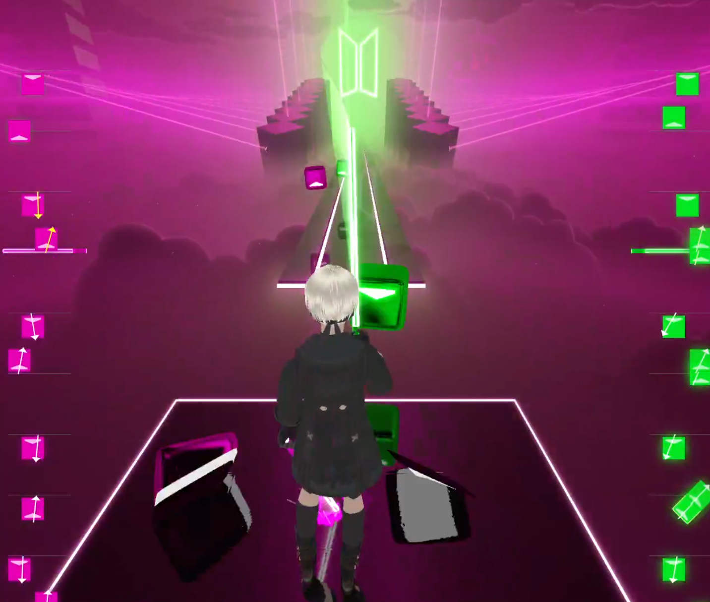

# Note History

A widget that tracks Beat Saber notes in a 2D interface in real time. It can be used as a local display or added as a Browser source in OBS for videos and streams.

Created by [Protected](https://github.com/Protected/). Contains cut intersection algorithms and vector math by [opl-](https://github.com/opl-/).

**Requires:** The [Beat Saber HTTP Status](https://github.com/opl-/beatsaber-http-status/releases) mod for Beat Saber (at least **v1.19**). It's usually available on Mod Assistant, and when it isn't it's usually because there was an update and the previous version still works.

**Source URL:** `https://protected.github.io/beatsaber-notehistory` (or set up your own!)

**[Quick OBS Setup](#quick-obs-setup)** - It's the same as every other widget!

**[Settings](https://github.com/Protected/beatsaber-notehistory/wiki/Settings)** - We have many settings you can use without setting up your own copy of NH.

**[Styles and customization](https://github.com/Protected/beatsaber-notehistory/wiki/Styles-and-customization)** - How the widget is structured so you can change its look and feel.

**[Reporting issues and getting help](#reporting-issues-and-getting-help)**

## Quick OBS Setup

Note that you may want to use multiple instances of this widget at the same time. That's fine! These instructions are for setting up one instance of the widget.

1. Add a new **Browser source** to your Scene.
2. Fill in the **Source URL** (from the top of this page) including the settings you want (read below).
3. Set the width and height. The width should be __144 times SCALE__ where SCALE is the value of your [scale](https://github.com/Protected/beatsaber-notehistory/wiki/Settings#scale) setting (by default it's 1) and the height is whatever you want.

If you want to adjust the position of the source, add the `test=1` setting to the URL, position the source, then go to properties and remove it.

## Reporting issues and getting help

**If you found a bug or have a sensible feature suggestion**, please open a ticket in the github repository where you found the widget. No other communication methods will be accepted. 

Always communicate your issue clearly and explain in detail what steps can be taken to reproduce it and what exactly is going wrong.

**You can open pull requests** with changes and styles you made. Please mind the contributing guidelines.

**If you need help, Discord is the best place to get it**. Be patient, don't ask for permission to ask your question, don't bump/repeat your message.
